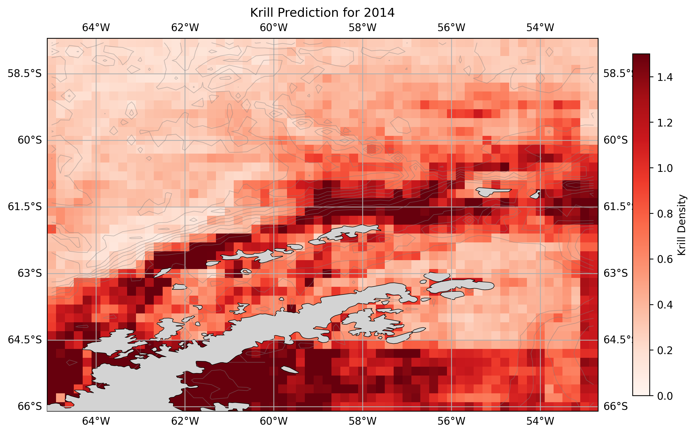

# krilldata
package for training and predicting krill density using multivariable regression methods

## Source code (krilldata/)
- readKrillBase.py handles reading and preprocessing data from krillbase
- dataFusion.py handles preprocessing of bathymetry and SST data, and fusion with krill observations
- krillTrain.py handles training of regression models
- krillPredict.py handles prediction of krill density using trained models

## Usage (usage/)
- train.py contains example workflow for training model to predict krill density
- mapKrill.py contains example workflow for mapping predicted krill density on input features e.g.


## Command line interfaces
### downloadCop.py
Command line interface for downloading data from Copernicus Marine Service according to `input/download_params.json`, requires credentials file;
From the project root directory, run:
```bash
python krilldata/downloadCop.py <dataKey>
```
where dataKey is a key as listed in `input/download_params.json`, for example:
```bash
python krilldata/downloadCop.py ssh
```
will download SSH data from Copernicus Marine Service and save to input/ssh.nc

Data visualisation:


### exploreNC.py
Command line interface for exploring contents of NetCDF/xarray datasets, requires a NetCDF/xarray dataset as input;
From the project root directory, run:
```bash
python krilldata/exploreNC.py <filename>
```
where filename is a NetCDF/xarray dataset, for example:
```bash
python krilldata/exploreNC.py input/ssh.nc
```
will explore contents of input/ssh.nc
```


